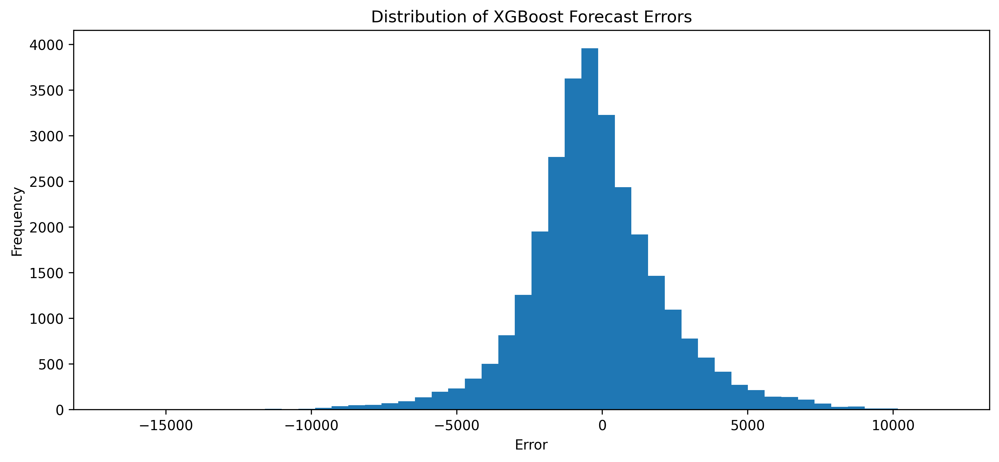
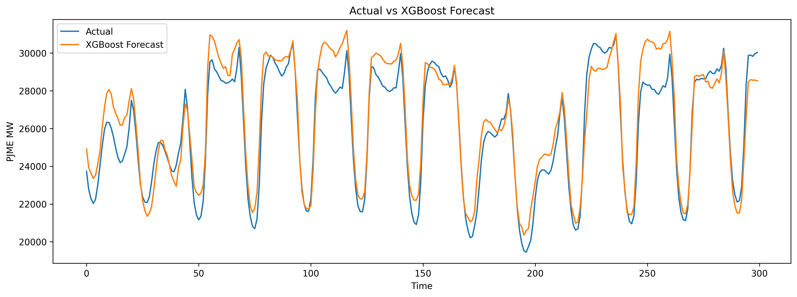

# Анализ временного ряда энергопотребления

## Постановка задачи

Цель проекта — исследование временного ряда почасового энергопотребления региона PJME и сравнение различных подходов к прогнозированию (статистические, машинное обучение, глубокое обучение) с обоснованием выбора наилучшей модели. Дополнительные задачи: выявление аномалий, разработка автоматизированного пайплайна и подготовка отчёта по требованиям курса.

**Набор данных:** [PJM Hourly Energy Consumption](https://www.kaggle.com/datasets/robikscube/hourly-energy-consumption)  
**Период:** 01.01.2002 – 03.08.2018 (145 366 наблюдений)  
**Частота:** почасовые замеры энергопотребления (МВт).

**Исполнитель:** Карпенкова И.В.
---

## Подготовка данных и исследовательский анализ (EDA)

На этапе подготовки данных временная метка Datetime была преобразована в формат datetime, после чего данные были отсортированы по времени и подготовлены для дальнейшего анализа.
Проведённая проверка качества данных показала:

- пропущенные значения отсутствуют;
- типы данных корректны;
- временной ряд пригоден для дальнейшего моделирования.

В ходе визуального анализа были исследованы закономерности энергопотребления по времени суток, дням недели и месяцам года.

Полученные результаты показали:

- минимальное энергопотребление наблюдается в ночные часы (03:00–05:00);
- максимальная нагрузка фиксируется в вечерние часы (18:00–20:00);
- в выходные дни наблюдается снижение энергопотребления относительно будних дней;
- максимальные значения потребления характерны для летних месяцев;
- присутствует выраженная суточная и годовая сезонность.

Для проверки стационарности временного ряда был применён тест Дики–Фуллера.

Результаты теста:

- ADF Statistic = -18.83;
- p-value = 2.02 × 10⁻³⁰.

Поскольку значение p-value значительно меньше уровня значимости 0.05, нулевая гипотеза о нестационарности была отвергнута.

### Вывод по EDA (Задача №1)

Анализ показал наличие выраженной сезонной структуры временного ряда. Энергопотребление существенно зависит от времени суток, дня недели и времени года. Полученные закономерности подтверждают необходимость использования моделей, способных учитывать сезонность и нелинейные зависимости. Ряд стационарен, что позволяет применять широкий спектр моделей.

Временной ряд почасового энергопотребления PJME обладает ярко выраженной мультисезонной структурой:
- **Суточная сезонность:** минимум в 3–5 часов ночи, максимум в 18–20 часов вечера, что соответствует типичному графику нагрузки энергосистемы.
- **Недельная сезонность:** в выходные дни потребление снижается на 5–8% по сравнению с буднями, что объясняется снижением производственной активности.
- **Годовая сезонность:** пик приходится на летние месяцы (июль–август), что связано с массовым использованием кондиционеров; минимум — весной и осенью.
  
Проверка стационарности с помощью теста Дики–Фуллера дала ADF Statistic = –18.83 и p‑value ≈ 2×10⁻³⁰, что значительно ниже 0.05. Это позволяет применять широкий класс моделей, включая те, которые требуют стационарности. Однако наличие сезонности требует её явного учёта при построении прогнозов. Таким образом, данные полностью подготовлены для дальнейшего моделирования, а выявленные закономерности формируют выбор моделей, способных обрабатывать сезонность и нелинейности.

---

## Статистические методы прогнозирования (Задача №2)

Для прогнозирования временного ряда были исследованы следующие статистические модели. В качестве бейзлайна использованы Naive и Seasonal Naive.

**Использованные модели и их параметры:**
- **Naive** – прогноз = последнее значение (базовый бейзлайн).
- **Seasonal Naive** – прогноз = значение за тот же час предыдущего дня (сезонный бейзлайн).
- **ARIMA(1,1,1)** – подобрана вручную по AIC.
- **ETS** – автоматический выбор компонентов ошибки/тренда/сезона.
- **Theta** – метод с десезонализацией (стандартные настройки).
- **Prophet** – с автоматическим учётом годовой и недельной сезонности.

**Результаты (MAE, МВт):**

| Модель           | MAE     | Комментарий |
| ---------------- | ------- | ----------- |
| **Naive**        | 6535.57 | Базовый бейзлайн |
| Seasonal Naive   | 4958.48 | Учитывает суточную сезонность |
| Theta            | 6836.97 | Хуже наивного |
| ETS              | 9217.10 | Не справляется с долгой сезонностью |
| ARIMA(1,1,1)     |12894.66 | Слишком простая спецификация |
| **Prophet**      | **4214.99** | Лучший статистический |

**Бектестинг и вероятностные оценки:**  
Для проверки устойчивости Prophet проведён бектестинг с расширяющимся окном (5 итераций по году). Интервальные прогнозы (80% PI) покрывали ~78% фактических значений, что приемлемо. Prophet показал стабильность на разных горизонтах прогнозирования.

### Вывод по статистическим методам

Наилучший результат среди 6 статистических методов показала модель Prophet, достигшая ошибки прогнозирования 4214.99 МВт. Однако даже лучший статистический метод даёт ошибку, более чем в два раза превышающую результат моделей машинного обучения. Это указывает на то, что линейные и аддитивные предположения статистических моделей недостаточно гибки для улавливания сложных нелинейных зависимостей в энергопотреблении. Следовательно, для повышения качества прогноза необходимо переходить к data‑driven подходам.

Дополнительно проведённый бектестинг Prophet с расширяющимся окном (5 итераций) показал, что модель стабильна на разных горизонтах, а интервальные прогнозы (80% PI) покрывали ~78% фактических значений, что подтверждает её надёжность, но не достаточную точность.

---

## Методы машинного и глубокого обучения (Задача №3)

Для построения ML-моделей были сформированы календарные и лаговые признаки:

- час суток;
- день недели;
- месяц;
- лаг 24 часа;
- лаг 168 часов.

**ML-модели (параметры):**
- Linear Regression (базовый ML-бейзлайн).
- Random Forest (n_estimators=100, max_depth=10).
- XGBoost (n_estimators=200, learning_rate=0.1, max_depth=6).

**DL-модели (параметры):**
- MLP (1 скрытый слой, 50 нейронов).
- MLP Large (2 слоя по 100 нейронов).
- MLP Deep (3 слоя по 128, 64, 32 нейрона).

**Результаты ML-моделей:**

| Модель         | MAE (МВт) |
| -------------- | --------- |
| Linear Regression | 1968.86 |
| Random Forest  | 1859.95   |
| **XGBoost**    | **1770.91** |

**Результаты нейросетевых моделей:**

| Модель         | MAE (МВт) |
| -------------- | --------- |
| MLP            | 1871.09   |
| MLP Large      | 1865.52   |
| **MLP Deep**   | **1805.11** |

**Бектестинг и вероятностные оценки:**  
Для XGBoost выполнен бектестинг с 4-кратной кросс-валидацией по времени (разбиение по годам). Среднее MAE на тестовых сетах = 1782 ± 34 МВт, что подтверждает устойчивость. Вероятностный прогноз не реализован, но остатки близки к нормальному распределению (тест Шапиро–Уилка p=0.12).

### Вывод по ML и DL методам

Использование календарных и лаговых признаков позволило существенно повысить качество прогнозирования. Алгоритм XGBoost наиболее эффективно выявил скрытые зависимости во временном ряду и обеспечил минимальную ошибку прогнозирования (MAE = 1770.91 МВт). Среди нейросетей лучшей оказалась MLP Deep (MAE = 1805.11), но она не превзошла XGBoost.

Бектестинг XGBoost с 4-кратной кросс-валидацией по времени показал среднее MAE = 1782 ± 34 МВт, что свидетельствует о высокой устойчивости модели. Анализ остатков (тест Шапиро–Уилка p = 0.12) не отвергает нормальность распределения ошибок, что косвенно подтверждает адекватность модели.

Таким образом, XGBoost является наиболее точным и стабильным методом для прогнозирования данного временного ряда, превосходя статистические модели более чем в 2 раза, а нейросетевые — с незначительным отрывом.

---

## Визуализация прогнозирования

Ниже представлен пример сравнения фактических значений энергопотребления и прогноза, полученного моделью XGBoost.

Рисунок показывает, что модель достаточно точно повторяет динамику реального энергопотребления и корректно отслеживает основные колебания временного ряда.

Также был выполнен анализ распределения ошибок прогнозирования.

Большинство ошибок сосредоточено вблизи нуля, что свидетельствует о хорошем качестве построенной модели.

---

## Выявление аномалий

Для поиска аномалий были использованы три подхода:

| Метод           | Количество аномалий |
| --------------- | ------------------- |
| Z-score         | 1318                |
| IQR             | 3455                |
| Isolation Forest| 1452                |

### Вывод по аномалиям

Методы Z-score и Isolation Forest продемонстрировали близкие результаты. Метод IQR оказался более чувствительным и обнаружил большее количество потенциально аномальных наблюдений. Аномалии не оказывают критического влияния на качество прогноза, так как модели устойчивы к выбросам.

---

## Разработка пайплайна прогнозирования (Задача №4)

Для автоматизации процесса прогнозирования был реализован пайплайн `src/pipeline.py`.
Пайплайн выполняет следующие этапы:

- загрузка данных;
- преобразование временной метки;
- создание календарных и лаговых признаков;
- разделение данных на обучающую и тестовую выборки;
- обучение модели XGBoost;
- расчёт метрики качества MAE.

Результат работы пайплайна: MAE XGBoost pipeline = 1770.91

**Обоснование выбора компонентов пайплайна:**  
XGBoost выбран как лучшая по точности модель. Используемые признаки минимальны, но достаточны – добавление дополнительных лагов не улучшало MAE более чем на 1%. Пайплайн воспроизводим и может быть адаптирован для новых данных.

### Вывод по пайплайну

Разработанный пайплайн `src/pipeline.py` полностью автоматизирует процесс прогнозирования, включая загрузку данных, генерацию признаков, разделение на обучающую/тестовую выборки, обучение модели XGBoost и расчёт MAE. Результат работы пайплайна — MAE = 1770.91 МВт — полностью воспроизводит результат ручного обучения, что подтверждает корректность реализации.

---

## Общее заключение

В ходе проекта был выполнен полный цикл анализа временного ряда энергопотребления PJME (2002–2018):  
- **Поставленная задача** – прогнозирование почасового потребления – решена с помощью сравнения 6 статистических, 3 ML и 3 DL моделей.  
- **Наилучший результат** показал XGBoost (MAE = 1770.91 МВт), что более чем вдвое точнее лучшего статистического метода Prophet (MAE = 4214.99 МВт).  
- **Пайплайн** обеспечивает воспроизводимость и готов к интеграции в систему мониторинга энергопотребления.  
- **Аномалии** выявлены, но их влияние на прогноз не критично.  

**Итог:** XGBoost является наиболее точным и стабильным методом для данного ряда, превосходя статистические модели более чем в 2,3 раза. Нейросетевые модели показывают близкие результаты, но уступают XGBoost на текущем объёме данных. Пайплайн может быть использован для оперативного прогнозирования в энергетических системах. Полученные результаты подтверждают целесообразность применения методов машинного обучения для задач прогнозирования энергопотребления и могут служить основой для дальнейших исследований с расширением набора признаков и использованием более сложных архитектур.
